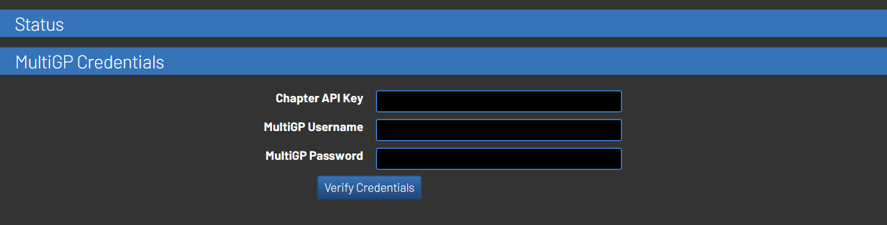
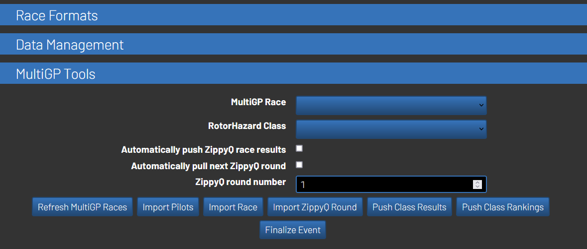
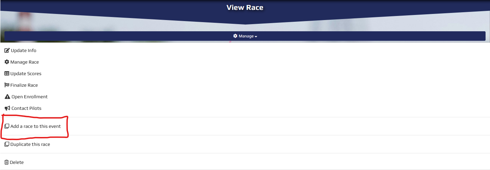
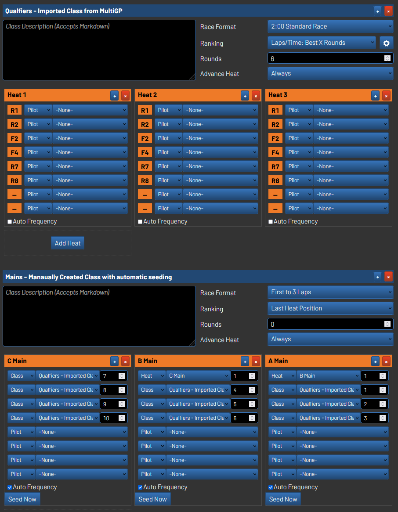

# MultiGP Toolkit for RotorHazard

> [!CAUTION]
> Please be aware that this plugin is not approved for MultiGP Global Qualifers, but the RotorHazard development team is currently in communication with MultiGP to potentially make this a future capability for the upcoming season. 

This is a plugin developed for the RotorHazard timing system. It allows for the ability to pull and push data through the MultiGP API to assist with event management.

This plugin now comes packaged with a mini version of [FPVScores](https://github.com/FPVScores/FPVScores) plugin allowing you to push your event results without the need to install the full version. If more features from the [FPVScores](https://github.com/FPVScores/FPVScores) plugin are needed, you can install the full version alongside the MultiGP Toolkit without issues.

## Requirements

- RotorHazard v4.0+ is required to run the plugin
- You will need your MultiGP Chapter's API key
- An internet connection when pushing or pulling data from MultiGP

> NOTE: An internet connection is not required for running the event, unless the automatic tools are being used

## Installation

To install, follow the instructions on the [latest release](https://github.com/i-am-grub/MultiGP_Toolkit/releases) of the plugin.

The plugin should be visable under the Settings tab after installing and rebooting. 

---

## User Guide

The plugin's functionality is split between the Settings and Format tabs in the RotorHazard UI.

### Settings - MultiGP Credentials

This screen is used to authenticate the RotorHarzard system to MultiGP. **Each time the system is restarted, the user must sign in again to activate the plugin's toolkit**

#### Chapter API Key (Text)

The API key for your chapter. Chapter admins should have access to this key by going to their chapter's home page and going to `Manage >> Timing system key >> Copy to Clipboard`

#### Verify Credentials (Button)

Used to check the entered credentials. If the credentials are valid, the user will be signed in and the toolkit will be activated.
- To sign the user out of the system, reboot the system
- Once signed in, the button will still be visable, but will become unusable.

### Format - MultiGP Tools

> Note: The terminology for a ***MultiGP Race*** is equivalent to a ***RotorHazard Class***

#### MultiGP Race (Selector)

Used to select which race the system will interact with on ***MultiGP***'s side

> [!NOTE]
> Races will typically stop appearing when the day of their scheduled event is about 2 months in the past. This characteristic is determined by MultiGP and not the plugin.

#### RotorHazard Class (Selector)

Used to select which class the system will interact with on ***RotorHazard***'s side

#### Use Automatic ZippyQ Tools (Checkbox)

The checkbox will enable the following tools when a ***RotorHazard Class***'s `Rounds` setting is set to 1:
- Once the race is saved (or a race is marshaled), automatically push the race results to MultiGP
- Automatically pull in the next ZippyQ round
- Set the newly pulled round as the active heat
- Automatically upload marshaled race info

> [!IMPORTANT]
>- The name of the class needs to match the MultiGP race. This is only required when using the Automatic ZippyQ Tools.
>When using this feature make sure the following ***RotorHazard Class*** settings are properly set:
>- `Rounds`: Should be set to 1
>- `Advance Heat`: Should be set to `Never`
>    - If set to `Always` or `After All Rounds`, the RotorHazard will try to advance the heat before the next ZippyQ round is imported.
>    - If this setting is active, the heat will be autoadvanced to to imported heat even with the setting set to `Never`

> [!TIP]
>- If you set up points in RotorHazard's race format, they will also be transfered to MultiGP
>- This setting is **NOT** influenced by the [MultiGP Race](https://github.com/i-am-grub/MultiGP_Toolkit#multigp-race-selector) or [RotorHazard Class](https://github.com/i-am-grub/MultiGP_Toolkit#rotorhazard-class-selector) selectors
>- If a pilot is not in the RotorHazard system and is needed in the race setup, they will automatially be imported
>    - Please see Notes under [Import Pilots](https://github.com/i-am-grub/MultiGP_Toolkit#import-pilots-button)

#### ZippyQ round number (Integer)

Set the round number ZippyQ will use when using `Import ZippyQ Round`

> [!IMPORTANT]
>When using this feature make sure the following ***RotorHazard Class*** settings are properly set:
>- `Rounds`: Should be set to 1
>- `Advance Heat`: Should be set to `Never`
>    - If set to `Always` or `After All Rounds`, the RotorHazard will try to advance the heat before the next ZippyQ round is imported.
>    - If using `Automatic ZippyQ Tools`, the heat will be autoadvanced to to imported heat even with the setting set to `Never`

#### FPVScores Event UUID (Integer)

> This setting will note be visable when the [FPVScores](https://github.com/FPVScores/FPVScores) plugin is also installed on the system

Set the Event UUID to use when pushing data to [FPVScores](https://fpvscores.com/)

> [!IMPORTANT]
> Currently, you must retreive the Event UUID from [FPVScores](https://fpvscores.com/) manually in order to use this feature

#### Refresh MultiGP Races (Button)

Refresh the options in the [MultiGP Race](https://github.com/i-am-grub/MultiGP_Toolkit#multigp-race-selector) selector

#### Import Pilots (Button)

Import pilots from the selected [MultiGP Race](https://github.com/i-am-grub/MultiGP_Toolkit#multigp-race-selector)

> [!NOTE]
>- This import includes the pilot's `MultiGP Pilot ID`. The `MultiGP Pilot ID` is mandatory for pushing results
>- The tool will try to find the pilot in the database by searching for a matching `MultiGP Pilot ID` or `Callsign`. If one can not be found, the pilot will then be added.

#### Import Race (Button)

Import the selected [MultiGP Race](https://github.com/i-am-grub/MultiGP_Toolkit#multigp-race-selector)

> [!IMPORTANT]
>- When pilots are added to their heats, they are assigned to their race slot by MultiGP's slot number, NOT their frequency.
>    - You can change the ***MultiGP Race***'s slot configuration by navigating to `Manage >> Manage Race >> Frequency Profile` on the MultiGP event's page. This should be configured before importing a ***MultiGP Race***.
>- If a pilot is not in the RotorHazard system and is needed in the race setup, they will automatially be imported
>    - Please see Notes under [Import Pilots](https://github.com/i-am-grub/MultiGP_Toolkit#import-pilots-button)

> [!IMPORTANT]
>If importing a ZippyQ race, heats will not be set up. You must import them using [Import ZippyQ Round](https://github.com/i-am-grub/MultiGP_Toolkit#zippyq-round-number-integer) and [Import ZippyQ Round](https://github.com/i-am-grub/MultiGP_Toolkit#import-zippyq-round-button)

#### Import ZippyQ Round (Button)

Imports the entered `ZippyQ round number` from the selected [MultiGP Race](https://github.com/i-am-grub/MultiGP_Toolkit#multigp-race-selector) into the selected [RotorHazard Class](https://github.com/i-am-grub/MultiGP_Toolkit#rotorhazard-class-selector)

> [!NOTE]
>- If a pilot is not in the RotorHazard system and is needed in the race setup, they will automatially be imported
>    - Please see Notes under [Import Pilots](https://github.com/i-am-grub/MultiGP_Toolkit#import-pilots-button)

#### Push Class Results (Button)

Pushes the results in the selected [RotorHazard Class](https://github.com/i-am-grub/MultiGP_Toolkit#rotorhazard-class-selector) to the selected [MultiGP Race](https://github.com/i-am-grub/MultiGP_Toolkit#multigp-race-selector)

> [!NOTE]
>- If the heats were modified from their imported state, the tool will attempt to organize and push all results to MultiGP.
>- If you set up points in RotorHazard's race format, they will also be transfered to MultiGP

> [!TIP]
> See [Pushing Multi-Class Results](https://github.com/i-am-grub/MultiGP_Toolkit#pushing-multi-class-results)

#### Push Class Rankings (Button)

Pushes the custom rankings in the selected [RotorHazard Class](https://github.com/i-am-grub/MultiGP_Toolkit#rotorhazard-class-selector) to the selected [MultiGP Race](https://github.com/i-am-grub/MultiGP_Toolkit#multigp-race-selector). 

By default, this button will not have any noticable impact on your results. This button is useful when a custom ranking method used for the class. For example, the custom ranking method (shown above) can be setup with `Best X Rounds` to only use a pilot's best 3 races, or `Last Heat Position` if a custom bracket is ran.

> [!TIP]
>- You can push the class results to MultiGP and then use the ***RotorHazard Class*** rankings to override the final race rankings on ***MultiGP***'s side
>- This action is equivalent to the ***Add Overall Results*** feature in the ***MultiGP Race***'s settings
> See [Pushing Rankings](https://github.com/i-am-grub/MultiGP_Toolkit#pushing-rankings)

#### Finalize Event (Button)

Finalizes the selected `MultiGP Race`
- It is considered best practice to verify your results on MultiGP before using this button.

#### Upload FPVScores Data (Button)

> [!NOTE]
> This setting will not be visable when the [FPVScores](https://github.com/FPVScores/FPVScores) plugin is also installed on the system

Pushes the event's data to [FPVScores](https://fpvscores.com/)

> [!IMPORTANT]
> Needs a [FPVScores Event UUID](https://github.com/i-am-grub/MultiGP_Toolkit#fpvscores-event-uuid) to function

#### Clear FPVScores Data (Button)

> [!NOTE]
> This setting will not be visable when the [FPVScores](https://github.com/FPVScores/FPVScores) plugin is also installed on the system

Clears the event's data on [FPVScores](https://fpvscores.com/)

> [!IMPORTANT]
> Needs a [FPVScores Event UUID](https://github.com/i-am-grub/MultiGP_Toolkit#fpvscores-event-uuid) to function

## Developer Notes

### Pushing Multi-Class Results

MultiGP allows you to create [events with multiple races] (https://www.multigp.com/races/view/?race=25935/BITS-Hyderabad-ATMOS-%2723-FPV-Race). If you have several different ***RotorHazard Classes*** within your event, this is one way to add them all. If you go to your event's page and click the dropdown menu, you should have the ability to add a race to your event. Repeat this until you have all your races added. The plugin will reconginze the added races individually, allowing you to push your individual [RotorHazard Class](https://github.com/i-am-grub/MultiGP_Toolkit#rotorhazard-class-selector) to its own [MultiGP Race](https://github.com/i-am-grub/MultiGP_Toolkit#multigp-race-selector) all under the same event.

### Pushing Rankings

My chapter likes to use our imported class from MultiGP to run our *Qualifers* for the night. We typically use the pilots' `Best 3 Rounds` during the *Qualifers* to seed our *Mains* bracket. Our *Mains* bracket will then be ranked using the `Last Heat Position`. We will push **results** of the *Qualifier* class, and then push the **rankings** of the Mains Class. An example of how this looks on MultiGP's side can be found [here](https://www.multigp.com/races/view/?race=26004/Anybody-Out-There)

