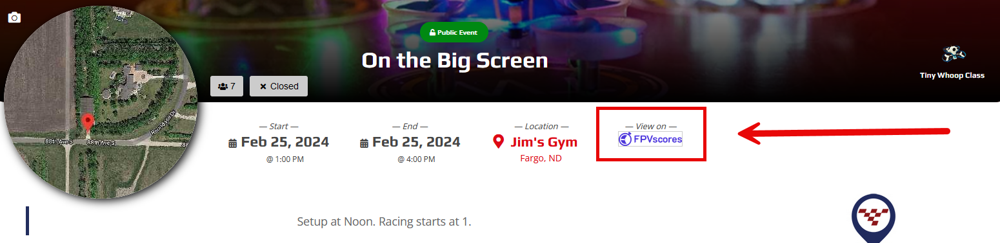

Setting Up FPVScores
===========================================

.. toctree::
   :maxdepth: 2
   :caption: Contents:

The RotorHazard Development Team has teamed up with with `FPVScores <https://fpvscores.com/>`_ to provide a platform to host your race results!

.. _fpvscores table:

.. list-table:: MultiGP Toolkit's Ability to Upload to FPVScores
    :widths: 15 15 25 45
    :header-rows: 1
    :stub-columns: 1
    :align: center

    * - 
      - Uploading to FPVScores is Optional
      - FPVScores Event UUID
      - Linking MultiGP Chapter API key to FPVScores Organisation
    * - Standard MultiGP Race
      - **Yes**
      - *Required* when FPVScores Organisation **is not** linked **or** *Optional* when FPVScores Organisation **is** linked
      - *Required* when FPVScores Event UUID **is not** provided at upload
    * - MultiGP Global Qualifier
      - **No**
      - *Not Required*
      - *Not Required*; when uploading without a linked FPVScores Organisation, the results will be uploaded without being linked to an FPVScores Organisation. These results **will not** be capable of being managed by an Organisation once uploaded.::

Linking a FPVScores Organisation
-------------------------------------------

1. Navigate to `FPVScores <https://fpvscores.com/>`_.

2. When signed in as a Organisation Organisator, open the event manager

    .. image:: event_manager.png
        :width: 600
        :alt: Event Manager
        :align: center

3. Open your Organisation's settings

    .. image:: organisation_settings.png
        :width: 600
        :alt: Event Manager
        :align: center

4. Enter your MultiGP Chapter's timer API key

    .. image:: chapter_apikey.png
        :width: 600
        :alt: MultiGP Chapter API key
        :align: center

5. Click the ``Update Settings`` button

You can now upload results to your FPVScores Organisation without providing an Event UUID to the MultiGP Toolkit when uploading your race results!

Finding and Event UUID for a race
-------------------------------------------

1. Navigate to `FPVScores <https://fpvscores.com/>`_.

2. When signed in as a Organisation Organisator, open the event manager

    .. image:: event_manager.png
        :width: 600
        :alt: Event Manager
        :align: center

3. Open the events page

    .. image:: events.png
        :width: 600
        :alt: Organisation Events
        :align: center

4. Click the ``COPY`` button for the event with the UUID you desire

    .. image:: uuid_copy.png
        :width: 600
        :alt: UUID Copy
        :align: center

Your UUID should now be stored within your Clipboard