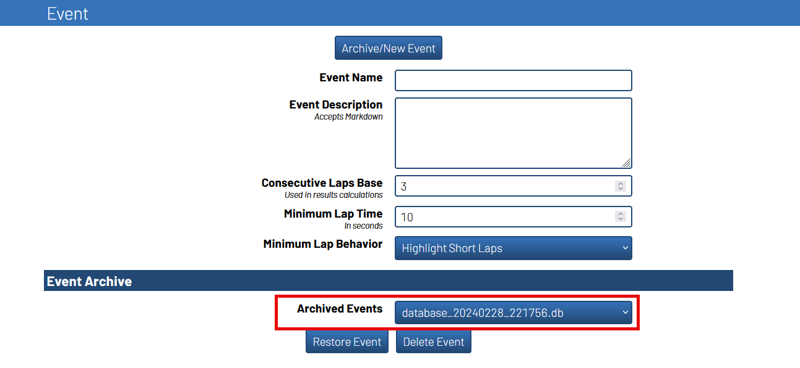

.. _importing from mgp:

Importing a Event into RotorHazard
==========================================

.. important::

        All instructions under this section will be performed under the ``Format`` page

        .. image:: format.png
                :width: 500
                :alt: RotorHazard Format page
                :align: center

        :raw-html:` `

Waiting for Plugin Activation
-------------------------------------------

After placing your MultiGP chapter's timer API key into the RotorHazard system,
the plugin will activate if the timer has an internet connection after rebooting.
The server will wait for a duration of time before checking the internet to give the
timer the some extra time to establish the connection.

Archiving any Previous Events
-------------------------------------------

Before importing a new event, it is best practice to archive your previous event. To archive
your previous event start by locating the ``Event`` panel.

1. Open up the ``Event`` panel and then click ``Archive/New Event``

    .. image:: archive.png
            :width: 500
            :alt: Archive Panel
            :align: center

2. Select ``Races, Heats, Classes, and Pilots`` from the drop-down selector

    .. image:: archive_selection.png
            :width: 500
            :alt: Archive Selection
            :align: center

3. Press ``Archive Event`` to backup your race data

    .. image:: archive_button.png
            :width: 500
            :alt: Archive Selection
            :align: center

Your previous event can now be seen under the ``Archived Events`` menu

Import a MultiGP Event
-------------------------------------------

1. Locate the ``MultiGP Race Import`` panel. The panel will include the name of the MultiGP chapter 
associated with the entered MultiGP API key.

    .. image:: race_panel.png
            :width: 500
            :alt: Race Panel
            :align: center

2. Select the race that you would like to import from MultiGP from the drop-down selector
and then click ``Import Race``

    .. image:: race_import.png
            :width: 500
            :alt: Race Import
            :align: center

.. tip::

        Turn on ``Download Logo`` to download the chapter's logo to the timer. It will automatically
        be added to your timer's home page.

        .. image:: home_page.png
                :width: 500
                :alt: Race Import
                :align: center

After importing, your race's name and description should be visable under the ``Event`` panel,
pilots imported under the ``Pilots`` panel, and a Class setup under the ``Classes and Heats`` panel.

