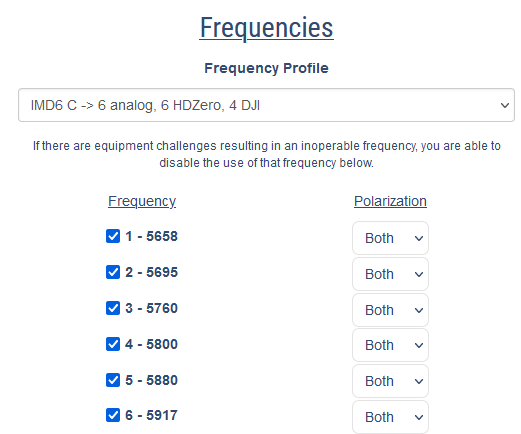
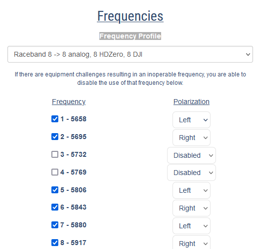
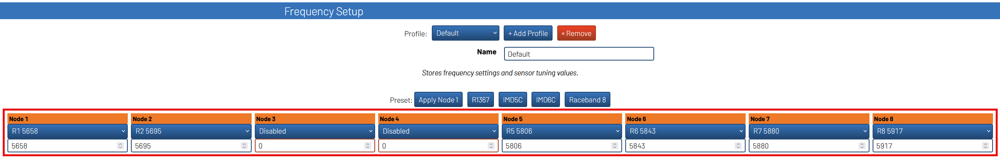
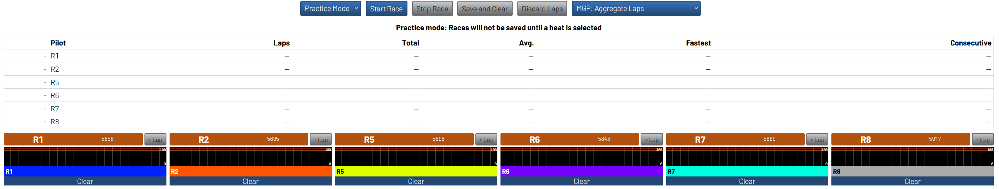
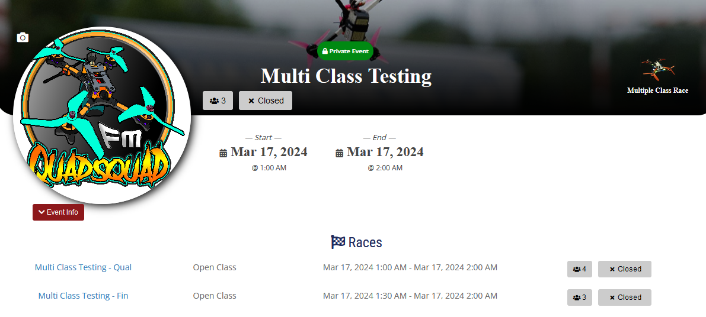
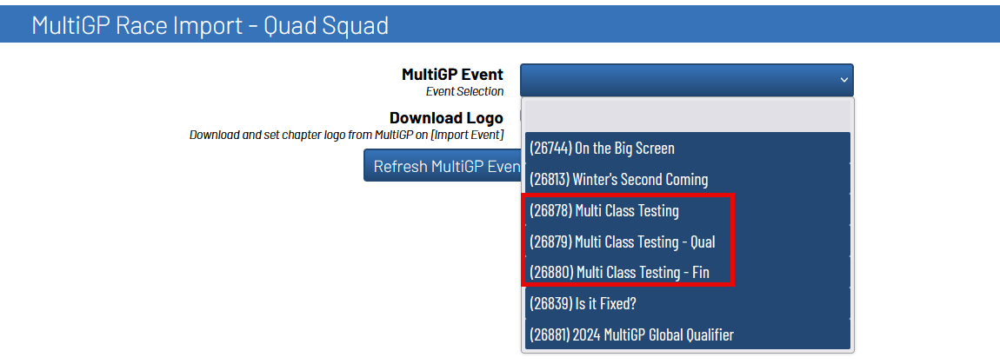

Importing Events into RotorHazard
==========================================

Archiving Previous Events
-------------------------------------------

.. important::

        All instructions under this subsection will be performed under the ``Format`` page

        .. image:: format.png
                :width: 500
                :alt: RotorHazard Format page
                :align: center

        If the panels under this subsection are not visable, verify your **timer** has an internet
        connection and reboot the system. For more information, review the section on the 
        :ref:`plugin's activation <plugin activation>`.

Before importing a new event, it is best practice to archive your previous event. To archive
your previous event start by locating the ``Event`` panel.

1. Open up the ``Event`` panel and then click ``Archive/New Event``

    .. image:: archive.png
            :width: 600
            :alt: Archive Panel
            :align: center

2. Select ``Races, Heats, Classes, and Pilots`` from the drop-down selector

    .. image:: archive_selection.png
            :width: 400
            :alt: Archive Selection
            :align: center

3. Press ``Archive Event`` to backup your race data

    .. image:: archive_button.png
            :width: 400
            :alt: Archive Selection
            :align: center

Your previous event can now be seen under the ``Archived Events`` menu

.. image:: archived_events.png
            :width: 600
            :alt: Archive Selection
            :align: center

.. note::

  The archived event will typically be named after the current ``Event Name``. In the
  case that there is already a archived database, the newly archived database will be named
  with the system's date and time it was archived at. If your timer does not have a Real Time
  Clock installed, the system's time may not have access to the correct date and time at the time
  of archiving. 

Setting Up MultiGP's Frequency Profile 
-------------------------------------------

The MultiGP frequency profile you can use is determined by the number of nodes within your RotorHazard timer.
MultiGP's ``IMD6`` profile has 6 slots, therefore in order to use it, your timer must have at least 6 functional nodes.
Likewise, since MultiGP's ``Raceband 8`` has 8 slots, you must have an 8 (or more) node timer.

Disabling Slots
^^^^^^^^^^^^^^^^^^^^^

When slots are disabled within a MultiGP frequency profile, they are not removed. For example, when disabling
two slots in MultiGP's ``Raceband 8`` frequency profile, it is still considered an 8 slot frequency profile.

In the event there have been slots disabled from the MultiGP frequency profile, you are able to disable
the equivalent nodes within RotorHazard's frequency profile.

There are a few advantages to disabling unnecessary nodes such as decluttering the RotorHazard UI and 
reducing the overall power consumption of the timer.

Importing an Event
-------------------------------------------

.. important::

        All instructions under this subsection will be performed under the ``Format`` page

        .. image:: format.png
                :width: 500
                :alt: RotorHazard Format page
                :align: center

        If the panels under this subsection are not visable, verify your **timer** has an internet
        connection and reboot the system. For more information, review the section on the 
        :ref:`plugin's activation <plugin activation>`.

1. Locate the ``MultiGP Race Import`` panel. The panel will include the name of the MultiGP chapter 
associated with the entered MultiGP API key.

    .. image:: race_panel.png
            :width: 600
            :alt: Race Panel
            :align: center

2. Select the race that you would like to import from MultiGP from the drop-down selector
and then click ``Import Race``

    .. image:: race_import.png
            :width: 600
            :alt: Race Import
            :align: center

.. tip::

    Turn on ``Download Logo`` to download the chapter's logo to the timer. It will automatically
    be added to your timer's home page.

    .. image:: home_page.png
            :width: 500
            :alt: Race Import
            :align: center

After importing, you should see a few changes made to the RotorHazard user interface. The following table outlines
the type of changes that should be shown depending on the type of race that was imported.

.. list-table:: What's visable after importing a race?
    :widths: 30 10 10
    :header-rows: 1
    :stub-columns: 1
    :align: center

    * - 
      - Controlled Race
      - ZippyQ Race
    * - Event Name Change
      - Yes
      - Yes
    * - Event Description Change
      - Yes
      - Yes
    * - Imported Pilots under the ``Pilots`` panel
      - Yes
      - No
    * - An imported class under the ``Classes and Heats`` panel
      - Yes
      - Yes
    * - Heats set up under the newly imported class
      - Yes
      - No
    * - A ``MultiGP Pilot Import`` panel
      - Yes
      - Yes
    * - A ``ZippyQ Controls`` panel
      - No
      - Yes
    * - A ``MultiGP Results Controls`` panel
      - Yes
      - Yes
    * - A ``ZippyQ Pack Return`` panel (under the ``Marshal`` page)
      - No
      - Yes

Multi-Race Events
^^^^^^^^^^^^^^^^^^^^^^^^^^^^^^^^^^^

The Toolkit offers support for running multi-race MultiGP events.

In the example above, ``Multi Class Testing`` is the parent event while 
``Multi Class Testing - Qual`` and ``Multi Class Testing - Fin`` are child
events.

There are two avaliable approach for fully completing the ``Multi Class Testing``
event with the MultiGP Toolkit.

1. Import and run a child event as you would for a standard MultiGP event. 
Upon completion of the child event, archive it and import the next child event. 
Repeat this process until all the child events have been completed.

2. Import the parent event. The Toolkit will setup a seperate class within
RotorHazard for each child event. It will also setup the ability to individually
push your race data and results to each child event. This is the
recommended approach when running a multi-race event offline.
      

