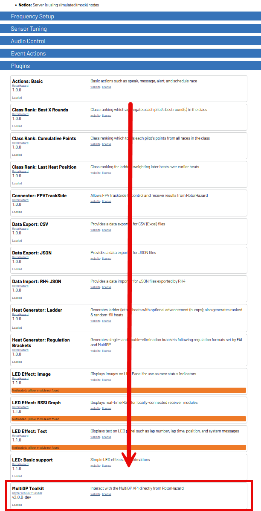

Plugin Installation
===========================================

These instructions assume that your RotorHazard instance is installed in the ``~/`` directory as outlined by the 
`RotorHazard Installation instructions <https://github.com/RotorHazard/RotorHazard/blob/main/doc/Software%20Setup.md#7-install-the-rotorhazard-server>`_.

If your version of RotorHazard is v4.3 and above, the recommended installation method will be to use the Community Store. For versions older than v4.3, the
CLI Installation method is recommended.

RotorHazard Community Store Installation
-------------------------------------------
.. note::
    This method is available starting in the beta versions of RotorHazard v4.3 which has not been released at the time of this plugin's latest release 

1. Open the RotorHazard user interface

2. Navigate to the ``Settings`` page

3. Open the ``Plugins`` panel

4. Click the ``Browse Community Plugins (online only)`` button

5. Open the ``Race Management`` panel

6. Click the ``Install`` button on the ``MultiGP Toolkit`` entry. Follow any instructions provided by the user interface

CLI Installation
-------------------------------------------

This is the recommended method for installing this plugin

1. Navigate to the ``~/`` directory

.. code-block:: bash

    cd ~

2. Remove any previous versions of the plugin

.. code-block:: bash

    sudo rm -r RotorHazard/src/server/plugins/multigp_toolkit

3. Download the latest release's ``zip file`` from `GitHub <https://github.com/i-am-grub/MultiGP_Toolkit/releases>`_

.. code-block:: bash
    :substitutions:

    wget https://github.com/i-am-grub/MultiGP_Toolkit/releases/download/v|project_version|/multigp_toolkit.zip

4. Unzip the download

.. code-block:: bash

    unzip multigp_toolkit.zip
    
5. Move the files over to the ``~/RotorHazard/src/server/plugins`` folder

.. code-block:: bash

    mv multigp_toolkit/custom_plugins/multigp_toolkit RotorHazard/src/server/plugins/

6. Delete the downloaded files

.. code-block:: bash

    rm multigp_toolkit.zip

7. Restart the server

.. code-block:: bash

    sudo systemctl restart rotorhazard.service

Manual Installation
-------------------------------------------

1. Navigate to the `MultiGP Toolkit's Releases <https://github.com/i-am-grub/MultiGP_Toolkit/releases>`_ page

2. Navigate to the release for version |project_version| (the latest stable release) and open the ``Assets`` tab.

    .. image:: assets.png
        :width: 600
        :alt: GitHub's Assets Tab
        :align: center

3. Download the ``multigp_toolkit.zip`` file

    .. image:: toolkit_zip.png
        :width: 600
        :alt: MultiGP Toolkit's zip file location
        :align: center

4. Unzip the downloaded file. Once unzipped, you should have a folder named ``multigp_toolkit``. 

5. Open the unzipped ``multigp_toolkit`` folder, and then open the ``custom_plugins``. There should now be another folder named ``multigp_toolkit``; this folder should be installed
into the ``~/RotorHazard/src/server/plugins`` folder within your RotorHazard installation

6. Restart the server

Verifying your Installation
-------------------------------------------

If installation is successful, ``MultiGP Toolkit`` should be listed under the ``Plugins`` panel under the ``Settings`` page after rebooting

