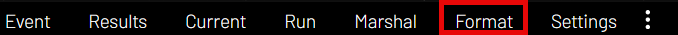

Pushing Results to MultiGP
=============================

All instructions under this subsection will be performed under the ``Format`` page

MultiGP Results Controls Panel
--------------------------------

.. image:: results_panel.png
    :width: 500
    :alt: Results Control Panel

Results Class
^^^^^^^^^^^^^^^^^^^^^^^^^^^^^^^^^

This drop-down selector is used to select the class to use for the race results on MultiGP's website.

.. image:: mgp_results.png
    :width: 500
    :alt: MultiGP Results

Rankings Class
^^^^^^^^^^^^^^^^^^^^^^^^^^^^^^^^^

This drop-down selector is used to select the class to use for the ``Overall Results`` on MultiGP's website under 
the ``Update Scores`` setting for your race.

.. image:: mgp_rankings.png
    :width: 500
    :alt: MultiGP Rankings

.. note::

    The use of this setting will require you to select a race that does **NOT** use the ``From Race Format`` 
    setting, otherwise, it will be skipped and MultiGP will automatically calculate the rankings based
    on the race format.

    .. image:: rh_ranking.png
        :width: 500
        :alt: RotorHazard Ranking

FPVScores Settings
^^^^^^^^^^^^^^^^^^^^^^^^^^^^^^^^^

There are two FPVScores related settings under the ``MultiGP Results Controls`` panels. The first setting
will either activate or deactivate the ability to push Results to FPVScores.

The second setting allows you to provide a FPVScores Event UUID to allow you to push your results
to a specific FPVScores event. See the table showing the mapped functionality of the :ref:`MultiGP 
Toolkit's Ability to Upload to FPVScores <fpvscores table>`.