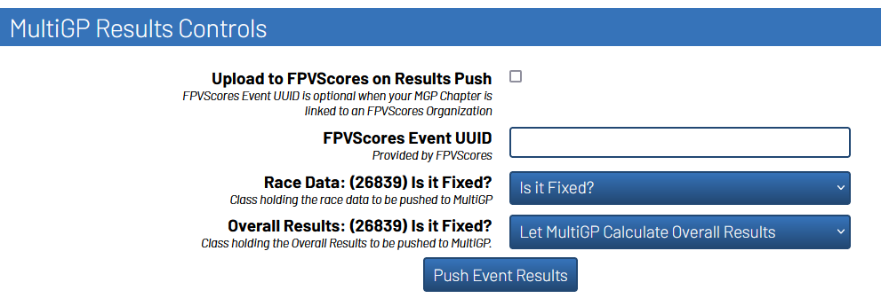

Pushing Results to MultiGP
=============================

.. important::

        All instructions under this section will be performed under the ``Format`` page

        .. image:: ../importing/format.png
                :width: 500
                :alt: RotorHazard Format page
                :align: center

        If the panels under this subsection are not visable, verify your **timer** has an internet
        connection and reboot the system. For more information, review the section on the 
        :ref:`plugin's activation <plugin activation>`.

MultiGP Results Controls Panel
--------------------------------

FPVScores Settings
^^^^^^^^^^^^^^^^^^^^^^^^^^^^^^^^^

There are two FPVScores related settings under the ``MultiGP Results Controls`` panels. 

- ``Upload to FPVScores on Results Push`` will either activate or deactivate the ability to push Results to FPVScores.
- ``FPVScores Event UUID`` allows you to provide a FPVScores Event UUID to allow you to push your results to a specific FPVScores event. 

.. seealso::
See the table showing the mapped functionality of the :ref:`MultiGP 
Toolkit's Ability to Upload to FPVScores <fpvscores table>`.

Race Data
^^^^^^^^^^^^^^^^^^^^^^^^^^^^^^^^^

This drop-down selector is used to select the class to use for the race data on MultiGP's website.

.. image:: mgp_results.png
    :width: 500
    :alt: MultiGP Results
    :align: center

Overall Results
^^^^^^^^^^^^^^^^^^^^^^^^^^^^^^^^^

This drop-down selector is used to select the class to use for the ``Overall Results`` on MultiGP's website under 
the ``Update Scores`` setting for your race.

.. image:: mgp_rankings.png
    :width: 500
    :alt: MultiGP Rankings
    :align: center

.. note::

    This setting has slightly different functionality depending on how the selected class is setup.
    
    - If the selected class has a custom ranking activated (``From Race Format`` is considered the ``OFF`` switch), then that generated ranking will be pushed to MultiGP.
    - Otherwise, the results based on the win condition of the race format within RotorHarzard will be used
    - If this option is set to ``Let MultiGP Calculate Overall Results``, the Toolkit will **not** push ``Overall Results`` to MultiGP 

    .. image:: rh_ranking.png
        :width: 500
        :alt: RotorHazard Ranking
        :align: center

Pushing Global Qualifier Results
----------------------------------

When running a Global Qualifier, you will be limited to only having the ability to
use the ``Push Event Results`` button. When this button is used, the data and results of
the imported MultiGP event will be pushed to MultiGP and FPVScores. You will need to
use this button at least once for your Global Qualifier results to be considered valid.

