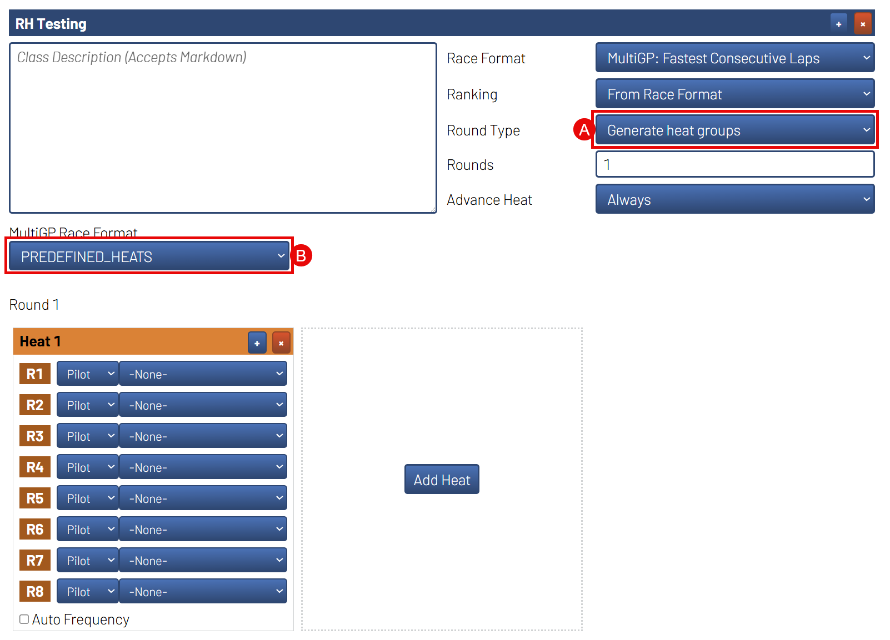
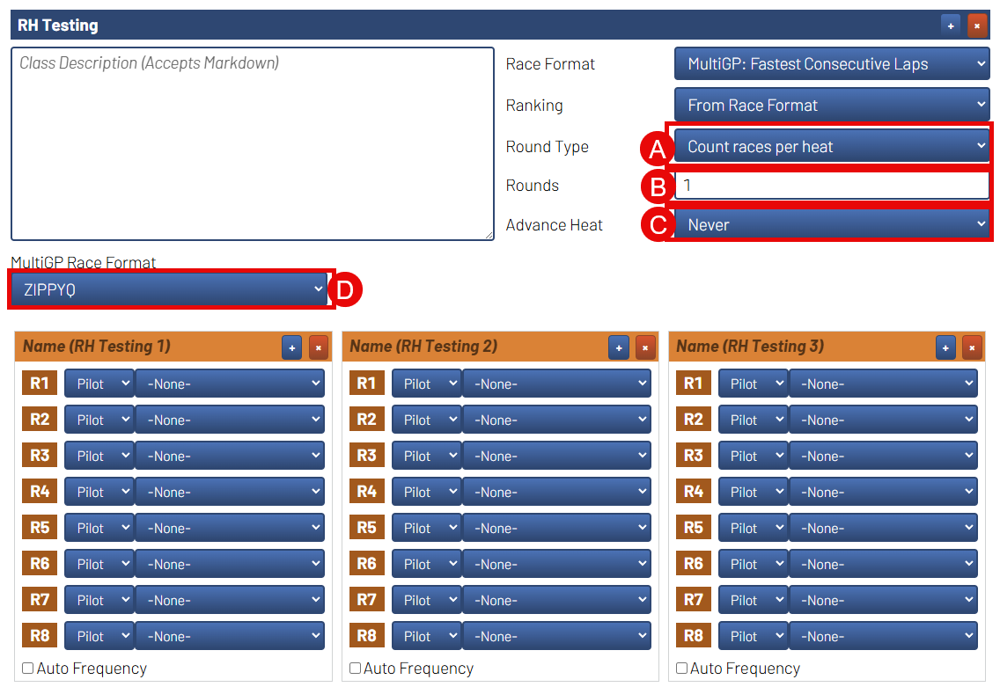

Running Races
===========================================

This section is for assisting Race Directors with running
their races with the MultiGP Toolkit installed on a RotorHazard system

Recommended Class Settings
-------------------------------------------

Each of the MultiGP schedules that you can use have their own set of
recommended settings to help make running you race smoother.

Controlled Races
^^^^^^^^^^^^^^^^^^^^^^^^^^^^^^^^^^^^^^^^^^^

The recommended settings for running a race with predefined heats includes the following:

A. Set ``Round Type`` to ``Generate heat groups``
    - This will allow the race director to edit their
    heats between rounds
B. Set ``MultiGP Race Format`` to ``PREDEFINED_HEATS``
    - This activates the features of the plugin specifically designed for predefined
    heats as well as tell the toolkit how to format the results when uploading
    to MultiGP

ZippyQ Races
^^^^^^^^^^^^^^^^^^^^^^^^^^^^^^^^^^^^^^^^^^^

The recommended settings for running a ZippyQ race includes the following:

A. Set ``Round Type`` to ``Count races per heat``
    - This will allow the system automatically create a new heat under the class
    without needing to interact with indivitual rounds within the class
B. Set ``Rounds`` to ``1``
    - This will prevent the system from trying to repeat a ZippyQ round
C. Set ``Advance Heat`` to ``Never``
    - A majority of the time, the next race is not imported by the time RotorHazard
    is ready to move to the next heat. If you want to have the system automatically
    import the next round and switch to it once imported, see the hints under
    :ref:`Import ZippyQ Rounds <zippy controls>`.
D. Set ``MultiGP Race Format`` to ``ZIPPYQ``
    - This activates the features of the plugin specifically designed for ZippyQ
    as well as tell the toolkit how to format the results when uploading
    to MultiGP

Enforced Rules
-------------------------------------------

When the MultiGP Toolkit is install on a RotorHazard system there are a
certain set of rules it enforces to ensure that the results generated
by the system are capable of being uploaded to MultiGP reliably.

All Races
^^^^^^^^^^^^^^^^^^^^^^^^^^^^^^^^^^^^^^^^^^^

The follow rules will be enforced by the system for any race ran with
the plugin installed. This **INCLUDES** any races under classes and heats
that were manually created.
    
- A pilot is only allowed to occupy one slot per heat
- There should be at least one pilot in the heat

ZippyQ Races
^^^^^^^^^^^^^^^^^^^^^^^^^^^^^^^^^^^^^^^^^^^

The follow rules will be enforced by the system for a race belonging to
a class that was generated by importing a ZippyQ race.

- ZippyQ rounds must be ran in the order in which they were created
- Completed ZippyQ rounds cannot be repeated.

.. _gq rules:

Global Qualifiers
^^^^^^^^^^^^^^^^^^^^^^^^^^^^^^^^^^^^^^^^^^^

The follow rules will be enforced by the system for a race belonging to
a class that was imported as a Global Qualifier (Controlled or ZippyQ).

- An approved version RotorHazard and the MultiGP Toolkit must be used for running Global Qualifiers. This includes the primary RotorHazard codebase as well as the MultiGP Toolkit's codebase.

.. seealso::

    :ref:`Software version requirements for Global Qualifiers <gq versions>`.

.. note::

    The MultiGP Toolkit contains a system to notify the
    race director when a mandatory update is available for 
    either RotorHazard or the MultiGP Toolkit

- A minimum of 3 pilots are required per heat
- The imported class from MultiGP can not be altered and must be used for the Global Qualifier event (results will not be uploaded otherwise)
- The format assigned to the imported class from MultiGP cannot be altered with exception to the settings that manage the start/stop behavior of the timer
- Other plugins can not be used to register laps

ReRunning Races
-------------------------------------------

In the event a race needs to be rerun, you should ``Stop`` the race and then ``Discard Laps``. This will prevent the race results from being saved
into the internal database. Once the results are saved into the database, they can not be deleted.

1. Stop the Race

    .. image:: standard.png
        :width: 500
        :alt: Stopping Race
        :align: center

2. Discard Laps

    .. image:: stopped.png
        :width: 500
        :alt: Discarding Laps
        :align: center

Move Race Results
^^^^^^^^^^^^^^^^^^^^^^^^^^^^^^^^^^^^^^^

In the event that the results were saved to the internal database and the race needs to be rerun, you will need to reassign the results to
another heat to prevent the race data from being associated with your MultiGP event.

1. Navigate to the ``Format`` page 
2. Locate the ``Classes and Heats`` panel 
3. Add a new Class
4. Add a new Heat to the class

    .. image:: dummy_heat.png
        :width: 600
        :alt: Dummy Heat
        :align: center

5. Navigate to the ``Marshal`` page 
6. Select the Heat and Round you would like to reassing
7. Select the Heat you would like to reassign the race data to and click ``Reassign Heat``

    .. image:: reassign.png
        :width: 600
        :alt: Dummy Heat
        :align: center