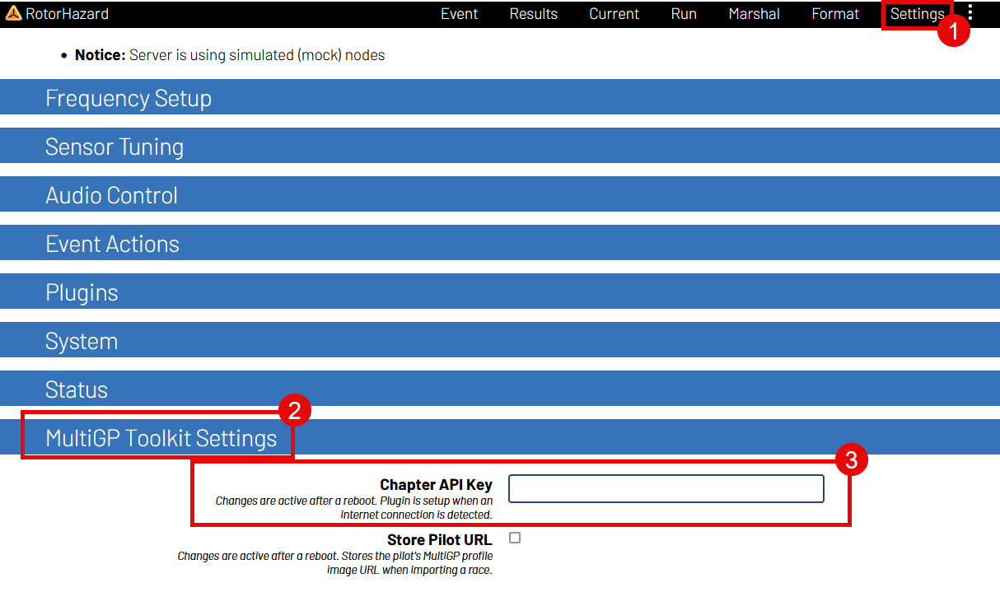
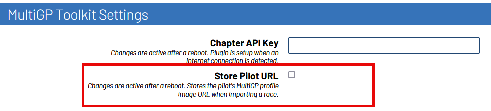

Activating the MultiGP Toolkit
===========================================

In order to activate most of the MultiGP Toolkit's functionality, your MultiGP chapter's timer API key must 
be provided.

Adding your MultiGP Chapter's API Key
-------------------------------------------

1. Navigate to the ``Settings`` page within RotorHazard

2. Open the ``MultiGP Credentials`` panel

3. Enter your timer's API key

.. note::

    After inputting your API key, make sure to click somewhere outside of the entry's text box. RotorHazard's 
    internal database will not register the entry otherwise

4. Reboot the RotorHazard server.

.. _plugin activation:

Waiting for Plugin Activation
-------------------------------------------

After inputting a MultiGP API key, anytime the timer is rebooted, the plugin will attempt to
connect to MultiGP to verify the key. To compensate for the time it may take for timer
to connect to the network, the plugin will make a multiple attempts to establish a connection 
over a period of time. It will continue to attempt until it is either successful or the max number 
of attempts has been reached.

In the event that the timer has successfully connected and the MultiGP API key has been 
verified, the plugin's user interface will activate.

Store Pilot URL
-------------------------------------------

This is a feature that will have the Toolkit store the URL for the pilot's MultiGP 
profile picture when importing an event from MultiGP. It is currently setup to work 
with SkyFPV's `Pilot Photos <https://github.com/skyfpv/rh_pilot_photos>`_ plugin for
livestreaming.