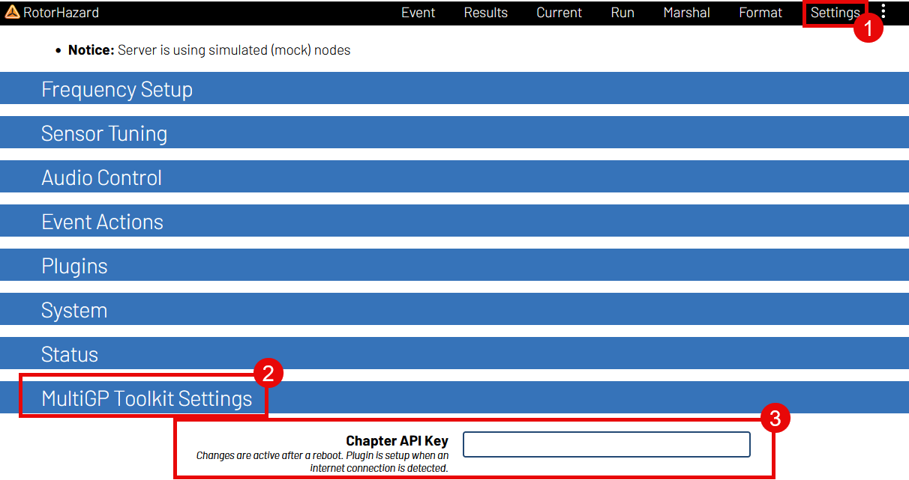

Activating the MultiGP Toolkit
===========================================

In order to activate most of the MultiGP Toolkit's functionality, your MultiGP chapter's timer API key must be provided.

1. Navigate to the ``Settings`` page within RotorHazard

2. Open the ``MultiGP Credentials`` panel

3. Enter your timer's API key

.. note::

    After inputting your API key, make sure to click somewhere outside of the entry's text box. RotorHazard's internal database will not register the entry otherwise

4. Reboot your RotorHazard server. 