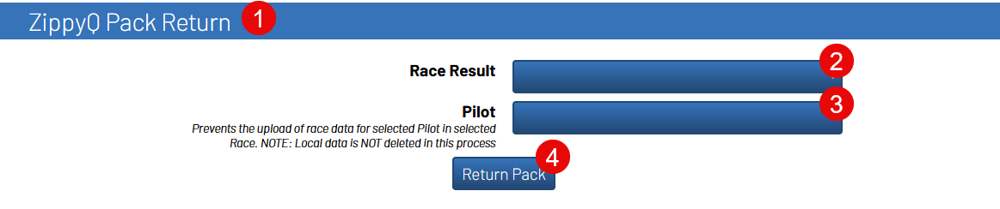

Using MultiGP's ZippyQ System
==============================

Import ZippyQ Rounds
------------------------------

All instructions under this subsection will be performed under the ``Format`` tab

.. image:: ../importing/format.png
        :width: 500
        :alt: RotorHazard Format Tab

After importing a race with ZippyQ enabled, a new class under ``Classes and Heats`` will
be created. This class will not have any heats under it.

.. image:: zippyq_class.png
        :width: 500
        :alt: ZippyQ Class

1. To import rounds from MultiGP, locate the ``ZippyQ Controls`` panel. *Note:* This panel is only visable when a ZippyQ race has been imported

    .. image:: zippyq_controls.png
            :width: 500
            :alt: ZippyQ Controls Panel

2. Open the ``ZippyQ Controls`` panel and click the ``Import Next ZippyQ Round`` button

    .. image:: import_round.png
            :width: 500
            :alt: Import ZippyQ round

You should now have the first ZippyQ round imported

.. image:: imported_round.png
        :width: 500
        :alt: Imported ZippyQ round

*Optional:* Turn on ``Use Automatic ZippyQ Import``. This feature will automatically download the next
ZippyQ round when the race for the previous one has finished. This prevents the need to click the ``Import Next ZippyQ Round``
after every round.

*Optional:* Turn on ``Active Race on Import``. This feature will automatically set the next round as the
active race after downloading either manually or automatically. This feature will trigger the ``Heat Change``
event within RotorHazard if you have an ``Event Action`` setup under the ``Settings`` tab.

ZippyQ Pack Return
------------------------------

All instructions under this subsection will be performed under the ``Marshal`` tab

The toolkit supports the functionality to give a pilot their pack back after a race if needed.

1. Select the Race the pilot particpated in from the ``Race Result`` selector

2. Select the pilot in the ``Pilot`` selector

3. Click the ``Return Pack`` button

.. note::

    The race director will still need to manually remove the pack from ZippyQ through
    the MultiGP ZippyQ admin kiosk for the race.

.. note::

    This action will not remove the results from the RotorHazard system; it will only prevent
    the future upload of the selected results. To remove the results from the RotorHazard system,
    manually remove the laps from the race for the pilot.

    Only removing the laps from RotorHazard system without returning the pack will result in the
    pilot having the result of ``0 Laps`` for the race instead of being removed.